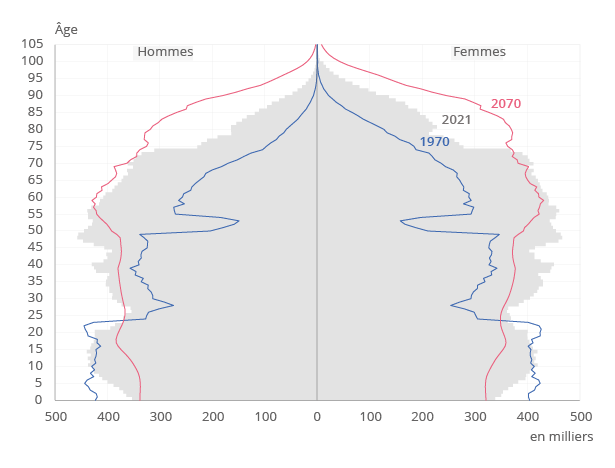

L'actu plus en profondeur - Journée de solidarité

# Sommaire:

[Article](#article)

 

## Article

Le gouvernement envisage de créer une seconde journée de solidarité.
En lisant la presse je me suis demandé quel est le bilan de la 1ʳᵉ journée qui a été mise en place ? La première ayant été mise en place 2004, nous avons un peu plus de 20 ans de recul pour connaitre les effets de cette mesure.
Ce point n'étant pas détaillé dans la presse j'ai creusé un peu le sujet.
J'ai trouvé uniquement deux documents sur le sujet:
* Un rapport de l'Assemblée nationale datant de 2008 : https://www.assemblee-nationale.fr/13/rapports/r0738.asp
* Une question/réponse de 2012 sur le bilan financier de la journée de solidarité : https://www.assemblee-nationale.fr/dyn/13/questions/QANR5L13QE68328

Dans le rapport de 2008 j'ai découvert d'une part que la traduction de cette journée travaillée gratuitement se traduit concrètement par une augmentation de 0.3 d'impôts sur les revenus d'activité et de remplacement (CSA) que les employeurs acceptent de payer, car leurs employés travaillent une journée gratuitement.
D'autre part j'ai découvert que les recettes ne se concentrent pas uniquement sur les salariés, en effet pour équilibrer la charge la contribution sur les revenus de patrimoine et le revenu de placements ont également été rehaussés de 0.3%.

Enfin on observe bien des recettes supplémentaires d'environ 2 Milliard d'euros, comme annonce par ceux qui proposent la loi.

Dans ce rapport de 2008 l'opposition pose déjà à l'époque la question sur l'affectation réelle des sommes prélevé supplémentaire. Le rapport a conclu que l'affectation des sommes a bien été respectée au cours des 4 premières années.
 

La question/réponse m'a permis de faire le tableau ci-dessous des recettes de solidarité par année en milliards d'euros.



### Pour aller plus loin :

La pyramide des âges en France montre que la question du financement des retraites n'est pas prête de s'arrêter. L'infographie ci-dessous, issue de l'Insee https://www.insee.fr/fr/statistiques/5893969 montre la différence entre la pyramide de 1970, 2021 et celle hypothétique de 2070.
On peut voir que la population à la retraite par rapport à la population active diminue jusqu'en 2070 et ne semble pas pouvoir se stabiliser avant 2080.

Cela pose de nombreuses questions : 

* Combien de journées de solidarités seront nécessaires pour passer l'inversion du rapport retraité / population active ?
* Comment dégager plus de richesse par personne ? Est-ce que l'optimisation de nos taches par des moyens techniques (automatisation, IA,...) ou organisationnel (meilleure méthode de travail, management,...) peut-être suffisant ? 
* L'optimisation des richesses crées par personne implique une concentration des richesses. Comment répartir ces richesses ? Quel contrat social nous permettra d'accepter de donner plus que ce que l'on reçoit ? 
* Comment les futurs retraités peuvent investir leurs temps en bonne santé et leur argent pour combler leurs besoins futurs en ayant peu besoin des générations suivantes ?  

