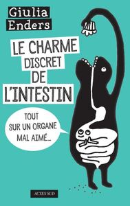

résumé du livre le charme discré de l'intestin - auteur : Giulia Enders

# Sommaire:

[Résumé du livre](#resume)
[Organisation du livre](#organisation)
[Conclusion](#conclusion)

 
## Résumé du livre 

Ce livre est écrit par Giulia Enders, une médecin.

L'autrice nous introduit son livre avec sa vie : une maladie de peau l'amène à faire de nombreuses expériences sur son propre corps à base de régime alimentaire plus ou moins loufoques. Après une victoire sur sa propre maladie s'ensuivent des études de médecine.

Elle a à cœur de partager ces connaissances scientifiques, le fait avec talant et humour. Ce livre est un régale à lire, remplis de connaissances sur le corps humain, du plus anecdotique au plus utile. Les dessins de sa sœur qui illustre le livre ajoutent de l'humour et une belle façon de retenir les propos.

  

 

## Organisation du livre 

le livre est composé de trois grand chapitre:

* Le charme discret de l'intestin
* Le cerveau d'en bas 
* La planète microbienne

 

## Le charme discret de l'intestin 

Cette première partie est remplie de petites histoires sur le fonctionnement du corps humain.

En commençant de façon anecdotique, l'autrice nous explique comment nous connaissons si mal notre corps à commencer par notre bouche, et la source de la salive (qui savait que la salive était du sang filtré ?).

Elle passe sur des sujets beaucoup plus pratiques comme comment reconnaître une crise d'appendicite ou de quel côté se placer quand on a des reflux acides. Enfin elle nous explique les différentes selles, leur composition : non pas des restes de nos repas, mais principalement, de l'eau, des bactéries, des fibres, et d'autres trucs dont le corps a voulu se débarrasser.

 

## Le cerveau d'en bas

Cette deuxième partie nous raconte l'histoire d'un morceau de gâteau dans notre corps, de la mise en bouche jusqu'à la sortie.

C'est l'occasion de passer tout un tas d'organe en revue et de mettre du sens derrière des conseils communs :

* Nos intestins ont "une fée du logis" qui profite du vide des intestins pour faire le ménage, d'où l'importance de ne pas grignoter en permanence et le conseil classique de nutritionnistes d'attendre 5h entre les repas.

* Nos intestins ont des détecteurs d'une hormone (CRH - Corticotropin-releasing hormone), quand celle-ci est en grande quantité ils déclenchent une réaction de secours : diarrhée, nausées ou vomissements. Je trouve que cette réaction de secours ressemble à s'y méprendre à des syndromes menstruels, et une recherche rapide sur le net indique en effet que "L'hormone de libération de la corticotrophine (CRH) est synthétisée dans la plupart des tissus reproducteurs féminins, tels que les ovaires et l'utérus". Ceci me semble expliquer des symptômes qu'on n’imagine pas intuitivement aller de pair.

* ...

Le petit plus du livre est la nuance ajoutée dans les propos: si des chiffres moyens sont donnés pour la traversée d'une part de gâteau, il est bien expliqué qu'il existe de nombreuse variation entre les individus de quelques heures à quelques jours. Et que même pour un seul individu toutes les bouchées de gâteau n'auront pas le droit au même traitement ! Ces nuances s'appliquent à tous les niveaux, et le fait d'attendre 5h entre les repas n'est sans doute pas valable de la même façon pour tous.

 

## La planète microbienne

Cette dernière partie regroupe ce que j'avais le plus entendu du livre avant de le lire : le microbiote, les familles de microbes les bons, les mauvais, et comment ceux-ci peuplent nos intestins. L'autrice insiste dans cette partie sur le côté exploratoire de ce domaine: si les grandes lignes semblent claires (le microbiote à une influence non sur notre santé) la précision n'est pas encore là et de nombreuses questions restent sans réponses. Des hypothèses sont émises, mais de nombreux travaux restent nécessaires pour confirmer ces hypothèses:

 * De nombreuses maladies serait-elle seulement les symptômes d'un microbiote malade ?

* Se soignera-t-on avec des micro-organismes dans le futur ?

Et pour permettre aux chercheurs d'avoir des réponses à toutes ces questions et de mieux comprendre le microbiote, on peut participer au projet de recherche de <abbr title="Institut National de Recherche pour l'Agriculture, l'Alimentation et l'Environnement"> l'INRAE </abbr>, "Le French Gut".

Ce programme recherche actuellement (2025) 100 000 personnes pour donner leurs selles: https://lefrenchgut.fr/

 

## Conclusion 
Je vous conseille de lire ce livre, je comprends désormais pourquoi il a eu un tel succès !

Il nous remet à jour sur le fonctionnement connu de notre corps et nous dévoile un futur possible au vu des recherches actuelles.

 

