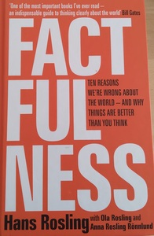
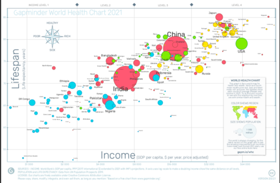
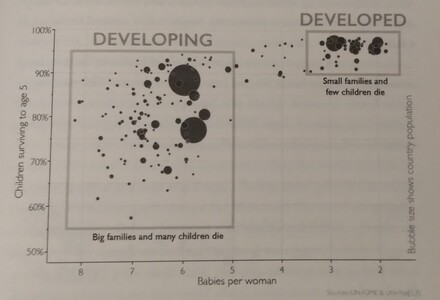
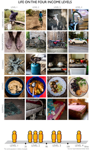
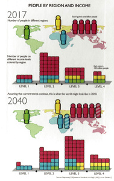
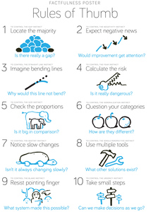
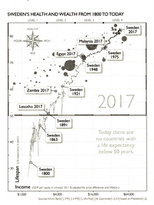
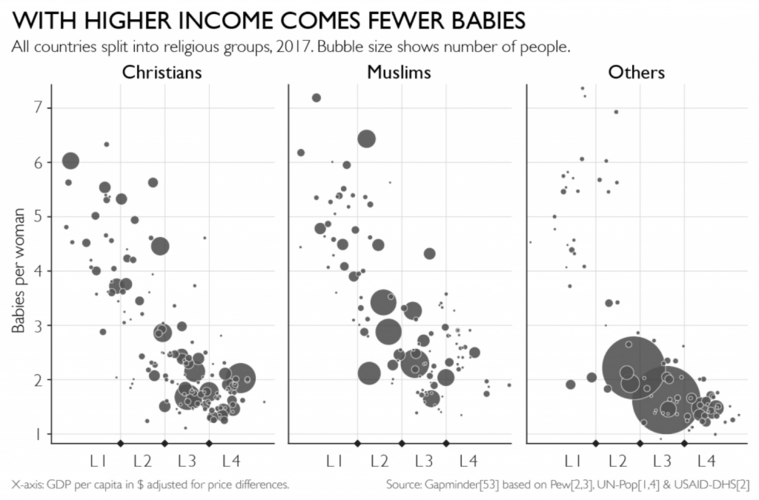
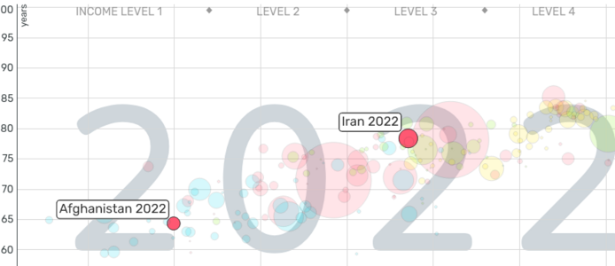
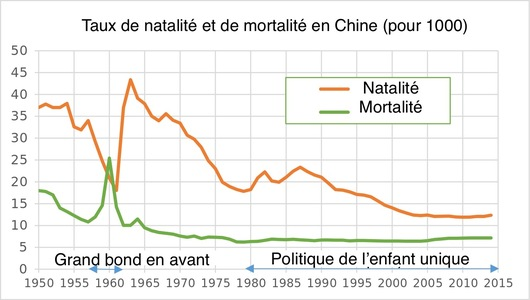

résumé du livre factfulness

# Sommaire:

[Résumé du livre](#resume)
[Organisation du livre](#organisation)
[Histoire intéressantes](#anecdote)
[Les avantages du livre: une autre vision du monde](#avantages)
[Critiques](#critique)
[Conclusion](#conclusion)
[Note](#note)

 

## Résumé du livre 
Ce livre est écrit par Hans Rosling, un médecin.
Le livre commence avec un QCM sur l'état du monde. (Vous pouvez vous tester ici: https://upgrader.gapminder.org/t/2017-gapminder-test/). 
Ces questions auxquelles la plupart des gens répondent très mal sont la base de son livre et son constat: nous connaissons très mal les données du monde. Et de mauvais faits ne permettent pas de bonne action.

  

L'auteur nous partage tout au long de ce livre trois points:
* Notre vision du monde date des années 60'
* plus les gens sont éduqués plus leur vision du monde est fausse (au QCM on répond statistiquement moins bien qu'au hasard). 
* Ce n'est pas parce que le monde va mal qu'il ne va pas mieux qu'avant. 

 

## Organisation du livre 

le livre est composé de quatre partie:

* Le QCM d'introduction
* Le corps du livre, divisé en dix instincts qu'on doit combattre 
* Des sources 
* Des données synthétisées. 

L'histoire commence avec un QCM. Que tout le monde échoue, d'autant plus si nous somme éduqués. On répond moins bien que le hasard. À tout sauf une question: le réchauffement climatique. Comment pouvons-nous nous tromper à ce point en faisant moins bien que le hasard ?

Lors d'étude de cas sur l'espérance de vie et la mortalité infantile, parlant des indigènes de la forêt équatoriale un élève fait une remarque "They can't live like us" (ils ne peuvent pas vivre comme nous)
Faignant de ne pas comprendre son élève l'auteur le titille et obtient différentes réponses: vous savez bien "le Nord et le Sud", "L'Orient et l'Occident", "les riches et les pauvres". Le professeur enchaîne les contre-exemples dans un dialogue comique pour lui signifier que cela ne veut rien dire: le Japon, la Malaisie, le Mexique. 

 
 
 

Je vous laisse ci-dessous le début du texte original rempli d'humour :

      A young student in the first row raised his hand. He tilted his head and said, “They can never live like us.” All over the room other students nodded in support.
      He probably thought I would be surprised. I was not at all. This was the same kind of “gap” statement I had heard many times before.
      I wasn’t surprised, I was thrilled. This was what I had hoped for. Our dialogue went something like this:
        me: Sorry, who do you mean when you say “they”?
        him: I mean people in other countries.
        me: All countries other than Sweden?
        him: No. I mean . . . the non-Western countries. They can’t live like us. It won’t work.
        me: Aha! (As if now I understood.) You mean like Japan?
        him: No, not Japan. They have a Western lifestyle.
        me: So what about Malaysia? They don’t have a “Western lifestyle,” right?
        him: No. Malaysia is not Western. All countries that haven’t adopted the Western lifestyle yet. They shouldn’t. You know what I mean.
        me: No, I don’t know what you mean. Please explain. You are talking about “the West” and “the rest.” Right?
        him: Yes. Exactly.
        me: Is Mexico . . . “West”?
      He just looked at me.
      I didn’t mean to pick on him, but I kept going, excited to see where this would take us.
 

À force de torture il obtient d'une élève une autre définition: << peut-être pouvons-nous diviser le monde en deux: les pays avec un taux de fécondité élevé et une forte mortalité d'un côté et ceux avec un taux de fécondité faible et une mortalité infantile faible. >> 

Ces données nous donnent le graphique ci-dessous: 

  

Cette figure, on est nombreux à l'avoir en tête. D'un côté, des pays en voie de développement, de l'autre des pays développés. Un gap entre les deux où très peu de pays sont présents. Par contre on se rend compte rapidement que ce graphique est vieux: la chine, le plus gros cercle, avec une moyenne de 6 enfants par femme, ça ne date pas d'aujourd'hui. 

le graphique plus récent (2017) c'est celui-ci: 

  

Pour être exact le précèdent graphique date de 1965. Une vision datée mais dont on entend très souvent les expressions consacrées: un monde séparé en deux où l'on peut opposer: dévoloppé/en développement, riche/pauvre. Ces expressions persistent, même chez de jeunes étudiants, alors qu'elles ne sont plus d'actualité. 

L'auteur propose une autre vision du monde avec la fondation qu'il soutient : "gapminder fondation" 

Le principe est simple: 
On divise le monde en 4 en fonction des revenus exponentiels. À chacun de ces niveaux est associé des photos qui illustrent le mode de vie. 

  

Ces niveaux de vie sont mis en perspective avec l'espérance de vie des pays

  

 

L'auteur montre la répartition dans le monde de la population et de ces niveaux de vie. Il se permet même de faire des projections dans le futur. 

  

les instincts à combattre: 

Selon l'auteur 10 instincts (ou plutôt biais cognitifs) sont à combattre:
1. GAP: la tendance à regarder les extrêmes plutôt que la majorité 
2. NEGATIVITY: la tendance à voir le négatif plutôt que le positif
3. STRAIGHT LINE: la tendance à voir les lignes droites plutôt que tout autre forme. 
4. FEAR: la tendance à voir nos peurs plutôt que la réalité. 
5. SIZE: regarder des chiffres qui nous paraissent grands sans échelle de comparaison. 
6. GENRALISTION: la tendance à généraliser les choses. 
7. DESTINY: la tendance à croire que les choses sont immuables, destinées à être d'une certaine façon. Sans voir que les choses bougent doucement. 
8. SINGLE: voir le monde avec une seule grille de lecture, un seul outil. 
9. BLAME: notre tendance à chercher un coupable plutôt que de comprendre
10. URGENCY: répondre dans l'urgence et faire quelque chose plutôt que de comprendre

  

 
  
  

## Histoires intéressantes 

Ce livre est rempli d'anecdotes, souvent tirées de la propre expérience de l'auteur, qui à la fois illustre les 10 biais cognitifs, et à la fois nous rapporte des expériences. Je vous résume ici celles qui m'ont le plus marquées. 

### La Suède des années 1921 (Chapitre: NEGATIVITY)

Ce graphique met en perspective l'espérance de vie et le revenu de la Suède au cours du temps, avec l'espérance de vie et le revenu de tous les pays du monde en 2017. 
Cela permet de se rendre compte à quel point le monde a évolué ces dernières années et que la vie dans des pays "sous-développés" ressemble finalement à la vie qu'ont pu avoir nos parents ou grand-parents. L'auteur explique que sa grand-mère née en 1891, c'est un peu comme si elle était née en 2017 au Lesotho, un des deux seuls pays du monde à avoir une espérance de vie en dessous de 55 ans. 

### Hôpital (chapitre GENRALISTION)
Le médecin raconte une histoire, où une étudiante est en retard, lui et ses autres élèves sont dans l'ascenseur. La retardataire cours et un des étudiants tend ça jambe pour retenir l'ascenseur. 
Et Crack ! L'ascenseur s'est refermé sur la jambe de l'étudiant. 
Nous somme dans un hôpital d'un pays de niveau 2. Les ascenseurs n'ont pas de détecteur de présence. 
Le médecin local est estomaqué: "Je n'avais jamais vu ça. Comment pouvez-vous former des gens aussi stupides à la médecine ?". après un débat où le médecin tente de défendre son étudiante en expliquant que tous les ascenseurs chez nous sont équipés de capteurs, qui ne tombent jamais en panne et sont toujours très bien contrôlés, le médecin local conclu: "Donc votre pays est si sûr, que le monde à l'étranger est dangereux pour vous ?" 

### Religion et taux de naissance (Chapitre: DESTINY)

alt="religions et famille nombreuses"/>

### Peur (Chapitre: FEAR)
Le médecin raconte une de ces premières expérience en tant que jeune interne. On doit être dans les années 1960, c'est la pause de midi, il est seul pour s'occuper d'un patient.
Celui-ci est un pilote militaire,le médecin essaye d'enlever son gilet, mais celui-ci fait couler du sang, il demande à une infirmière 4 poches de sang. Le militaire s'exprime en charabia. Le médecin reconnaît du Russe. Il lui dit alors en russe "Ne vous inquiétez pas camarade, vous êtes dans un hôpital suédois". à ces mots le visage du pilote militaire se transforme en terreur pure. Il recommence à parler avec un charabia. Le médecin réalise alors: c'est un militaire russe qui a dû se faire descendre sur le territoire suédois. Cela signifie que l'union soviétique nous attaque ! Et que la troisième Guerre Mondiale est déclenché !!
à ce moment-là l'infirmière principale arrive et explique au militaire, en suédois: vous êtes resté dans l'eau gelée pendant 23 minutes, c'est pour ça que vous n'arrivez pas à parler.
L'auteur nous apprend par la suite qu'il a été élevé avec une terreur d'une 3e Guerre mondiale. Et que la peur lui a fait voir son pire cauchemars, un militaire russe au début de la 3e Guerre mondiale plutôt que la réalité: un Suédois blessé dans un vol de routine, gelé incapable de parler.

### Malaria (Chapitre: BLAME)
L’Unicef cherche à acheter des médicaments contre la malaria. Elle découvre un petit vendeur qui vend les pilules moins cher que le coût des matières premières. Est-ce un miracle ou une arnaque ? Le médecin va sur place avec de grosses suspicions. Ils confirment le prix des pilules. Comment est-ce possible ? Ont-ils des rabais exceptionnels sur les matières premières ? Non. Ils ont optimisé et automatisé leur production et produise en quelques jours les demandes. Ils se font alors payer. Or ils ont 30 jours pour payer les fournisseurs, ils leur restent 26 jours pour payer leurs fournisseurs. Et jouer en bourse avec l'argent. Ils peuvent ainsi vendre moins cher que leur coût de production. 

### Réfugiés (Chapitre: BLAME)
Savez-vous pourquoi il y a tant de migrants qui meurent dans la méditerranée ? 
* parce qu'ils sont pauvres et fuit la guerre ? 
* parce que des passeurs leur font payer une fortune une traversée sur des embarcations dangereuses ? 
mais dans ce cas-là :
* pourquoi ne passent-ils pas par les terres et par l'avion ? Après tout l’Europe a signée la convention de Genève qui nous oblige accueillir les réfugiées venues de Syrie. 
* Est-ce qu'ils n'ont pas asses d'argent ? On vient de dire qu'ils payent des milliers d'euros leur passage. Et l'auteur a vérifié, il existe des billets Londre-Libie ou Suède-Turquie pour moins de 50€. J'ai vérifié pour un Paris-turquie, c'est aux alentours de 100-150€ voir 300€ l'été. Bien moins qu'un passeur. 
Le problème se situe à l'aéroport, car il existe une directive européenne de 2001 disant que les compagnies aériennes doivent payer le billet retour des personnes en situation d'immigration illégale. Et comme le personnel des aéroports ne peut pas en 45 secondes estimer le statut de réfugié que nos administrations mettent des mois à statuer, ils ont décidés de ne laisser personne monter sans visa. Comme ça pas de risque de retour. Or les ambassades de ces pays en guerre n'ont pas la capacité d’émettre autant de visa que de personnes réfugiées (une recherche rapide m'a permis de voir qu'une seule ambassade syrienne est ouverte en Turquie, toutes les autres ayant fermé). 
* Et pourquoi utilisent t'ils des bateaux si minables ? après tout avec le prix par voyageur il y a des moyens. 
Là encore les lois européennes ont décidées de confisquer les bateaux de migrants dès leur arrivée. 
Dès lors si chaque bateau ne fait qu'un seul voyage il n'y a pas les moyens d'avoir de vrai bateau. C'est là que l'Europe se retrouve avec des pensées ambivalentes/duals. D'une part à luter pour aider des réfugiés fuyant la guerre, avec la convention de Genève, de l'autre à lutter contre l'immigration illégale avec des lois qui empêchent dans le même temps aux réfugiés légitimes d'arriver sains et saufs. Le tout en blâmant la pratique des passeurs que notre politique a contribué à créer. 

### Avortement (Chapitre: DESTINY)
Aujourd'hui beaucoup de monde à la vision d'une Suède pros-avortement et d'une Pologne plus conservative anti-avortement. Les lois poussent les femmes voulant avorter à faire de long voyage entre la Pologne et la Suède. 
L'auteur raconte que ces faits, souvent ancrés comme immuables dans nos esprits, changent avec le temps. Il raconte comment dans sa jeunesse, où l'avortement était interdit en Suède, il a participé à une collecte de fonds pour qu'une camarade de classe puisse aller avorter.. ..en Pologne. 
Il est assez surprenant de voir que les femmes de l'époque et celles d'aujourd'hui font, pour la même raison le trajet en sens opposé. 

### L'Iran n'est pas l’Afghanistan (Chapitre: DESTINY)

Après une conférence, une jeune Suédoise-Irannienne remercie l'auteur, car c'est la première fois qu'un Suédois disait du bien de son pays l'Iran. Car pour elle, tous ceux qu'elle avait rencontré, même des personnes très cultivés, avait tendance à mettre l'Iran et l’Afghanistan dans le même panier. 
C'est pour cet état de fait qu'une jeune Iranienne a félicité l'auteur lors d'une conférence. 
Lorsqu'on regarde la carte des revenus et de l'espérance de vie on observe que l'Iran a une espérance de vie d'un peu plus de 78 ans quand l’Afghanistan en a une d'un peu moins de 65 ans. Le niveau de vie de l'Iran rentre dans le "niveau 3" quand celui de l’Afghanistan est en "niveau 1". 

  

### Enfant unique (Chapitre: BLAME)

La politique de l'enfant unique n'est pas ce qui a permis de diminuer drastiquement la natalité en Chine. Ce serait plutôt l'augmentation du niveau de vie qui en est la cause. Pour cela l'auteur avance le fait que Hongkong, auquel ne s'appliquait pas cette politique a eu une baisse encore plus forte de la natalité que la Chine sur les mêmes périodes. 

La politique de l'enfant unique a durée de 1979 à 2015. Sur cette période la natalité Hongkongaise est passée de 2.12 à 1.20 et celle Chinoise de 2.72 à 1.67 soit une diminution légèrement plus faible. (source: https://datacommons.org)
Certain démographes pensent même qu'elle aurait créée une tendance inverse: on observe sur la courbe ci-dessous qu'elle rebondit légèrement, avant de reprendre sa tendance à la baisse quelques années plus tard (https://fr.wikipedia.org/wiki/Politique_de_l%27enfant_unique). 
Cette politique, en plus d'avoir été inhumaine, serait inefficace. 
Il est intéressant de noter qu'à contrario une politique moins autoritaire, lancée au début des années 1970, semblait fonctionner. Cette politique était nommée "mariage tardif, naissances peu rapprochées et peu nombreuses". Elle n'autorisait le mariage qu'à partir de 20 ans pour les femmes et 22 pour les hommes. 

### Erreur fatal (Chapitre: URGENCY)
Un mal étrange touche un village. L'auteur y est médecin. a priori ce n'est pas contagieux, mais comme il ne peut pas être sur complètement, il fait évacuer sa femme et son enfant, au cas où. 
Le maire l'apprend et interroge le médecin, s'il y a un risque que se soit contagieux, on doit faire quelque chose. Le médecin avoue, il y a un risque. 
Alors il faut faire fermer la route, pour pas que cela se répande. Le médecin approuve. 
Le soir, en retournant dans le quartier malade pour enquêter, le médecin croise des personnes près de corps inanimés. Il accourt pour les aider, mais c'est déjà trop tard. Des femmes, des enfants et des pêcheurs se sont noyées dans la rivière. - Mais que faisaient tous ces femmes et enfants sur un bateau aussi fragile ? L'habitant lui répond: il n'y avait pas de bus ce matin pour la ville, car la route était fermée. 
Le médecin a alors compris, qu'il a tué sans le savoir une vingtaine de femmes et d'enfants ce jour-là. 
Le médecin n'en aura parler à personne pendant 35 ans. Il s'en sert aujourd'hui pour expliquer que l'on doit réfléchir et se baser sur de bonne données plutôt qu'agir en urgence. 

### Les médias 
L'auteur conclut que ces biais cognitif qui nous empêche de voir le monde sous un angle factuel, sont exploités par les médias, pour vendre. Et qu'il faut prendre cela comme un fait, et savoir que les médias ne sont pas faits pour avoir une vision factuel du monde. 
Il serait en effet indécent d'ajouter après un fait divers terrible que malgré ça le monde s'améliore et que cela arrive bien moins que d'habitude (quoique ça pourrait être instructif). 

 

## Les avantages du livre: une autre vision du monde 

Ce livre et plus particulièrement les données sous forme de quatre niveaux de revenu associé à l'espérance de vie dans un graphique, me permet de voir le monde d'une nouvelle façon. C'est un outil permettant d'avoir une grille de lecture différente de ce qu'on a l'habitude de voir. 

En regardant ce tableau on peut y voir différentes données. si on tire une droite on peut voir une corrélation forte entre le niveau de vie et le PIB. Des pays en dessous de cette droite aurons une espérance de vie faible par rapport à leur revenu, comme les État-unis. Cela est probablement une mise en évidence de fortes inégalités au seins du pays. 
Cela permet de se poser poser de nouvelles questions:
* Que se passe t'il dans des régions comme le Centre-afrique ou Lesotho pour avoir une espérance de vie si basse ? 
* Comment a fait Nicaragua pour avoir une espérance de vie si haute avec des revenu si bas ? 
* Pourquoi la Corée du nord a une espérance de vie si haute avec ces revenu si bas ? Est-ce cela montre un PIB faussé par leur économie souterraine mal connue ? 
* Comment croire que toutes les belles promesse d'intégration de l’Ukraine à l’Europe ne sont pas que foutaise lorsqu'on voit leur niveau de vie si bas ? alors qu'on critique déjà les entrée précédentes de certains pays beaucoup plus proches de nous économiquement ? 

 

## Critiques 
Malgré tout ce que ce livre m'as appris j'ai quelques critique. 

### La positivisté
L'auteur veut dire que le monde va bien. Et il insiste **beaucoup** là dessus. 
Outre le fait qu'on se demande pendant une majorité du livre où est passé l'écologie, il présente deux doubles pages de données sur 16 mauvaises choses qui diminuent et 16 bonnes choses qui s'améliorent qui "prouvent" que le monde va mieux. C'est doubles pages d'inepties, m'ont retenue de lire ce livre la première fois que je l'ai croisée. Ce catalogue de données voudrait montrer que tout va bien seulement car le nombre de particule fines émise diminue et le nombre nouveau film augmente. Avec comme élément positif le nombre d'espèce menacée surveillée. 

### Les données
La qualité des données utilisées pour réaliser est questionnable. 
Tout abord le PIB est une mesure dont la définition a pu changer au cours du temps (comptabilisation de nouvelles données comme la prostitution ou la vente de drogue) de plus cette définition n'est pas toujours la même dans tous les pays (tous les pays ne comptabilise pas l'économie souterraine). 
Néanmoins ces données permettent une vision simple plus intéressante que la fameuse dualité du monde riche/pauvre et nous permet d'étayer notre vision des "pays pauvres".
Ensuite il manque l'espérance de vie en bonne santé. Cette donnée, probablement plus difficile a obtenir et plus subjectif est néanmoins plus importante. 
La représentation par pays masque les inégalités qu'il peut y avoir au seins d'un même pays, même si cela peut ressortir, comme pour les USA. 
Ensuite je vous encourage vivement à regarder les données sur le site gapminder plutôt qu'avoir uniquement une représentation d'une année. En effet faire défiler les années permet de se rendre compte de la volatilité des données présentés. En effet les pays sont relativement proche et bouge beaucoup. Par exemple la version du livre que j'ai lu contient un graphique de 2017 où l'Ukraine se situe au à la fin du niveau 2 de développement. Là où en 2022 elle s'approche plus de la moitié du niveau 3. 

 

## Conclusion 
Je pense vous avoir extrait tous les points important de ce livre, ainsi que les anecdotes les plus intéressantes. 
Mais il reste une question, si les média ne nous donne pas une vision factuel du monde, comment l'obtenir et bien s'informer ? 

 

## Note 
J'ai lu ce livre en version anglaise, les extraits présent ici, ont été traduit et interprété en fonction de ma subjectivité. Il ne s'agit pas d'une traduction littéral.

